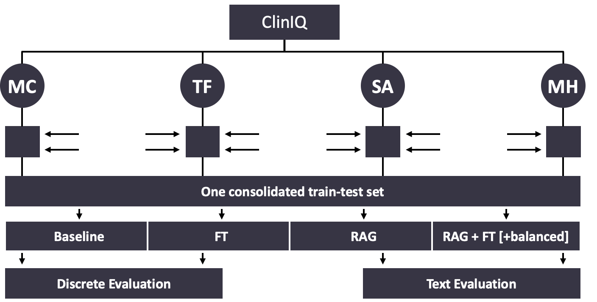

# ClinIQ: A Medical Expert-Level Question-Answering System
### Evaluate the ability of generative models to produce factually accurate medical information
**by Konstantin, Adria & Lorena**
--- 

[Challenge description (University of Maryland)](https://brandonio-c.github.io/ClinIQLink-2025/)

To solve the challenge, we fine-tuned DeepSeek Coder-7B within a Retrieval-Augmented Generation (RAG) framework.  

---
## Table of Contents

1. [Project Description](#project-description)
2. [Project Structure](#project-structure)
3. [Setup Instructions](#setup-instructions)
4. [Running the Project](#running-the-project)
5. [Reproducibility](#reproducibility)
6. [Team Contributions](#team-contributions)
7. [Results & Evaluation](#results--evaluation)
8. [References](#references)

---

## Project Description
### Question Types

The ClinIQ Challenge evaluates a domain-specific (medical) question-answering system across four question types: 

| **Question Type**             | **Example**                                                                                                                                                                                                                                                                          |
|-------------------------------|--------------------------------------------------------------------------------------------------------------------------------------------------------------------------------------------------------------------------------------------------------------------------------------|
| MC<br/> **Multiple Choice**   | ``` [{"correct_answer": "A", "options": { "A": "Localized immune complex", "B": "Ag- Ab reaction", "C": "Complement mediated", "D": "Ab mediated"}, "question": "Ahus reaction is…", "source": "MC4-UCSC-VLAA/MedReason", "type": "multiple_choice"}]```                             |
| TF<br/> **True-False**        | ``` [{"answer": "True",  "question": "Is reduced Klotho associated with the presence …?",  "source": "TF2-qiaojin/PubMedQA",  "type": "true_false"} ]```                                                                                                                                 |
| SA<br/> **Short Answer**      | ``` [{"question": "What is the value of …?",  "answer": "In the late distal tubule, [TF/P]osm is less than 1 when there is low ADH.",  "source": "SA2-Ajayaadhi/Medical-QA",  "type": "short_answer"}    ]```                                                                            |
| MH<br/> **Multi-Hop**         | ``` [{"question": "In a study assessing …?",  "answer": "In a normal...",  "reasoning": [  "Step 1: Alright, ...",  "Step 2: When a student’s...",  "Step 3: I remember from stats that ...",…],  "source": "MH-FreedomIntelligence/medical-o1-reasoning-SFT",  "type": "multi_hop"}]``` |

The goal is to achieve a higher performance compared to the baseline model by fine-tuning the **deepseek-coder-7b-instruct-v1.5** model and embedding it in a RAG pipeline to access additional knowledge.

### Strategies
We explored and evaluated a range of modeling strategies to tackle the ClinIQ challenge:

| **Approach**             | **Explanation**                                                                             |
|--------------------------|---------------------------------------------------------------------------------------------|
| **1 Baseline**           | performance evaluation of the **deepseek-coder-7b-instruct-v1.5**                           |
| **2 FT (Fine-tuning)**   | fine-tuned **deepseek-coder-7b-instruct-v1.5** using LoRA on 9 medical datasets             |
| **3 RAG**                | (Naive) adding a RAG pipeline to the baseline model (Pinecone INDEX 1)                      |
| **4 RAG + FT**           | (Advanced) adding a RAG pipeline to the fine-tuned model (knowledge base: Pinecone INDEX 1) |
| **5 [RAG + FT balanced]** | (Advanced) same as **RAG + FT** but knowledge base in Pinecone (INDEX 2) is **balanced**    |





We perform question type specific evaluation for each of the 5 modeling strategies:
- Discrete Evaluation for MC and TF (classification accuracy)
- Text Evaluation for SA and MH (generative quality, BLEU/ROUGE, etc.)

### System Architecture

Our Advanced RAG pipeline performs **hybrid retrieval** from a large training dataset and PubMed abstracts, combining **semantic search** and **metadata filtering**. The retrieved top k contexts are passed to the fine-tuned model to generate expert-level medical answers. Data sources are integrated via Pinecone and Google Drive, ensuring scalable and efficient knowledge access.


### Workflow

Our workflow consists of several key stages. Below is a summary of each step, along with links to the relevant notebooks for code execution. For in-depth explanations, please refer to our [Technical Documentation](TECHNICAL_DETAILS.md).

     Data Collection & Processing Training set  
We unified and preprocessed **9 datasets** covering all question types (MC, TF, SA, MH). More than 500k questions were gathered across 9 different datasets with different layouts,  producing a consolidated train-test set.
[1a_Preprocessing_dataset Notebook →](1a_Preprocessing_dataset.ipynb) [Technical Documentation - data-collection-preprocessing](TECHNICAL_DETAILS.md#data-collection-preprocessing) 


     RAG Knowledge Base Population & Retrieval Setup
We designed a RAG pipeline with a hybrid retriever and populated its Pinecone vector store with two core sources:
  - **Training Dataset** (400K questions with metadata)  
  - **PubMed Abstracts** (reduced to ~15K via topic modeling)

Multiple steps in preprocessing and filtering were required to populate our Pinecone knowledge base:
- **RAG-Specific Preprocessing**
 We assigned unique, type-specific IDs to all training samples and PubMed abstracts. This step ensures reliable document tracking across Retrieval, Model context injection and Evaluation. 
Since we designed the retriever to return only document IDs of the Pinecone knowledge base, this mapping is crucial to reconstruct full context from the Google Drive-stored content before passing it to deepseek.
[1b_Preprocessing_RAG Notebook →](1b_Preprocessing_RAG.ipynb) [Technical Documentation - rag-specific-preprocessing](TECHNICAL_DETAILS.md#rag-specific-preprocessing)


- **PubMed Topic Modeling (INDEX 1)**
To overcome Pinecone’s index size limits, we reduced the original **2.5M PubMed abstracts** to a more representative sample of 11 k abstracts using topic modeling. This ensured better coverage and diversity while staying within memory constraints.
 [2c_TopicModeling_PubMed Notebook →](2c_TopicModeling_PubMed.ipynb) [Technical Documentation - topic-modeling](TECHNICAL_DETAILS.md#topic-modeling-index1)


- **PubMed Balanced Index Creation (INDEX 2)**
Post-presentation, we observed significant imbalance in **Index 1:** 400K training questions vs. 11K PubMed entries.
To address this, we created a balanced **Index 2** with: 100K training samples (20K per question type) and 100K PubMed abstracts  
[2d_PubMed_train_balanced Notebook →](2d_PubMed_train_balanced.ipynb) [Technical Documentation - balanced index](TECHNICAL_DETAILS.md#pubmed-balanced-index2)


After populating the Pinecone vectorstore, we conducted experiments on a subset of our data to determine the optimal number of top-k retrieved contexts to augment our LLM with:
- **k-parameter experiments**
We experimented with different `k` values in our retriever, validating through both literature and empirical tests. We finalized **k = 5** based on performance and efficiency.
 [2b_NaiveRAG_k_experiment →](2b_NaiveRAG_k_experiment.ipynb) [Technical Documentation - retrieve-k-experiments](TECHNICAL_DETAILS.md#retrieve-k-experiments)


  
     Baseline for Comparison

As part of our evaluation, ...
 [2a_Baseline_7bcoder.ipynb →](2a_Baseline_7bcoder.ipynb)  
[Technical Documentation - baseline ](TECHNICAL_DETAILS.md#baseline)


     Fine-Tuning  
 [3a Training Notebook →](3a_Training_7b_LoRA_balanced.ipynb) [Technical Documentation - fine-tuning](TECHNICAL_DETAILS.md#fine-tuning)


    Evaluation
 [4_Evaluation_RAG+FT Notebook →](4_Evaluation_RAG+FT.ipynb) [Technical Documentation - evaluation](TECHNICAL_DETAILS.md#evaluation) 


  


---

## Project Structure

```
.
├── content/
│   ├── k_experiments/                  
│   └── Topic_modeling/  
├── data/
│   ├── raw/                            # Raw dataset
│   └── processed/                      # Processed dataset for /Pubmed /testdata /trainingdata
├── metrics/     
│   ├── evaluation_suite.py             # Evaluation suite for all Question Types
│   ├── final_results/                  # Evaluation suite results for all experiments
│   │   ├── AdvRAG+FT/
│   │   ├── BalancedAdvRAG+FT/
│   │   ├── Baseline/
│   │   ├── FineTuning/
│   │   └── NaiveRAG/
├── models/                             # Fine-tuned deepseek model
├── utils/
│   ├── prompt_utils.py                 # templates to generate model input
│   ├── RAG_adv_pipeline.py             # defining Hybrid Retriever & QA-chain
│   ├── RAG_answer.py                   # extraction of answer (letters) for all Question types
│   ├── RAG_metadata.py                 # metadata extraction for pinecone upsert & query
│   ├── RAG_naive_pipeline.py           # defining Naive Retriever & QA-chain
│   ├── RAG_pinecone.py                 # pinecone index creation, inserting data, index stats
│   └── RAG_preprocessing.py            # defining data paths, adding id & source info to all datasets
├── visuals/
├── .gitignore
├── 1a_Preprocessing_dataset.ipynb      # Preprocessing of 9 datasets for all Question types
├── 1b_Preprocessing_RAG.ipynb          # RAG specific preprocessing of 9 datasets for pinecone insertion
├── 2a_Baseline_7bcoder.ipynb           # Baseline deepseek
├── 2b_NaiveRAG_k_experiment.ipynb      # experiments to determine optimal k retrieved contexts parameter
├── 2c_TopicModeling_PubMed.ipynb       # PubMed articles Topic Modeling & upsert to pinecone (INDEX 1)
├── 2d_PubMed_train_balanced.ipynb      # populating balanced-index (INDEX 2) 
├── 3_Training_7b_LoRA_balanced.ipynb   # Fine-tuning deepseek
├── 4_Evaluation_RAG+FT.ipynb           # Eval
├── 5_Demo.ipynb
├── config.py                           # defining temp / max. new token / INDEX_NAME for experiments
├── README.MD
└── requirements.txt
```

---

## Setup Instructions

--------------- TO DO-------------------

> [!NOTE]  
> This is only a Template. And you can add notes, Warnings and stuff with this format style. ([!NOTE], [!WARNING], [!IMPORTANT] )

### Clone Repository
```bash
git clone [repository-url]
cd [repository-folder]
```

### Create Environment
```bash
python -m venv venv
source venv/bin/activate  # Unix or MacOS
venv\Scripts\activate     # Windows
```

### Install Dependencies
```bash
pip install -r requirements.txt
```

---

## Running the Project

--------------- TO DO-------------------

Follow these notebooks in order:
1. `1_Preprocessing.ipynb` - Data preprocessing
2. `2_Baseline.ipynb` - Establishing a baseline model
3. `3_Training.ipynb` - Model training
4. `4_Evaluation.ipynb` - Evaluating model performance
5. `5_Demo.ipynb` - Demonstration of the final model

You can also run custom scripts located in the `utils/` directory.

---

## Reproducibility
--------------- TO DO-------------------

- **Random seeds:** Make sure random seeds are set and noted in your notebooks.
- **Environment:** Include the exact versions of libraries used (already covered by `requirements.txt`).
- **Data:** The data used for fine-tuning the model that has been processed in the preprocessing files can be accessed over websites such as Kaggle and Huggingface. 
- **Model Checkpoints:** Provide checkpoints clearly named and explained.

---

## Team Contributions

| Name       | Contributions                                                                           |
|------------|-----------------------------------------------------------------------------------------|
| Lorena     | RAG-Preprocessing & Set-Up, Visualization, RAG-Evaluation, Documentation                |
| Konstantin | Baseline model and Fine-tuning, Preprocessing, Visualization, Evaluation, Documentation |
| Adria      | Data collection, Preprocessing, Visualization, Evaluation, Documentation                |


---

## Results & Evaluation
--------------- TO DO: insert overview table of results-------------------

- We have decided on a number of evaluation metrics to evaluate the model approaches for both closed-end and open-ended questions.
The Advanced RAG plus FT model consistently outperformed other models across most evaluation metrics, demonstrating strong performance across question types.
In Multiple Choice and True/False tasks, the FT model showed the highest accuracy for True/False questions (0.655), while Advanced RAG plus FT led in most other Multiple Choice metrics.
For Short Answer generation, Advanced RAG plus FT achieved the best scores in BLEU, METEOR, ROUGE, and similarity metrics, with notably high precision and recall.
The base model consistently underperformed, scoring significantly lower than the other models in all evaluation categories which has shown the continuous improvement over different model approaches. Multi-Hop reasoning results mirrored the Short Answer findings, with Advanced RAG plus FT again leading in terms of performance.

---

## References


## Datasets

| Dataset Name                                              | Source Description / Citation |
|-----------------------------------------------------------|-------------------------------|
| FreedomIntelligence/medical-o1-reasoning-SFT              | Chen et al. (2024). Huatuogpt-o1, towards medical complex reasoning with LLMs. |
| openlifescienceai/MedMCQA                                 | Pal et al. (2022). MedMCQA: A large-scale multi-subject multi-choice dataset for medical domain QA. |
| stellalisy/mediQ                                          | https://huggingface.co/datasets/stellalisy/mediQ |
| bigbio/MedQA                                              | Jin et al. (2021). What disease does this patient have? A large-scale open-domain QA dataset from medical exams. |
| UCSC-VLAA/MedReason                                       | Wu et al. (2025). MedReason: Eliciting factual medical reasoning steps in LLMs via knowledge graphs. |
| Ajayaadhi/Medical-QA                                      | https://huggingface.co/datasets/Ajayaadhi/Medical-QA |
| Comprehensive Medical Q&A Dataset (Kaggle)                | https://www.kaggle.com/datasets/thedevastator/comprehensive-medical-q-a-dataset |
| HPAI-BSC/OpenMedQA                                        | Bayarri Planas, J. (n.d.). https://huggingface.co/datasets/HPAI-BSC/OpenMedQA |
| qiaojin/PubMedQA                                          | https://huggingface.co/datasets/qiaojin/PubMedQA |
| MedRAG/pubmed                                             | Xiong et al. (2024). Benchmarking retrieval-augmented generation for medicine. |


---
## Directory of Writing Aids

| Aid                 | Usage / Application                                                                 | Affected Areas |
|---------------------|--------------------------------------------------------------------------------------|----------------|
| **Google's Gemini**     | Debugging and generation of code    | Preprocessing |
| **Chat GPT 4.0 – OpenAI** |Brainstorming relevant metrics for Evaluation, Writing, Formatting| Entire repository   | 
| **Perplexity.AI** |Writing, Formatting| Entire repository   |
<sub>Table 1: Writing Aids (Art. 57 AB)</sub>

