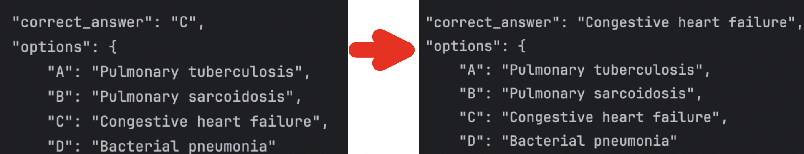
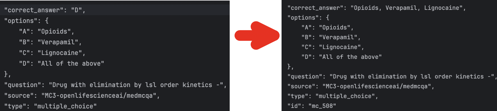
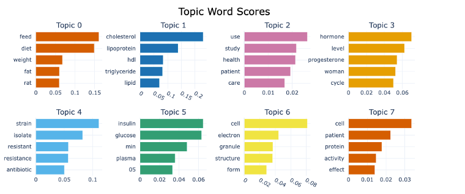
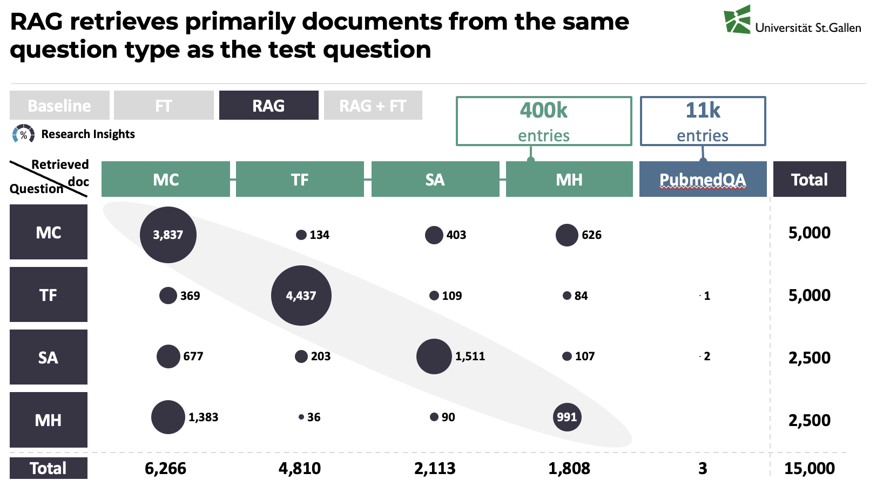
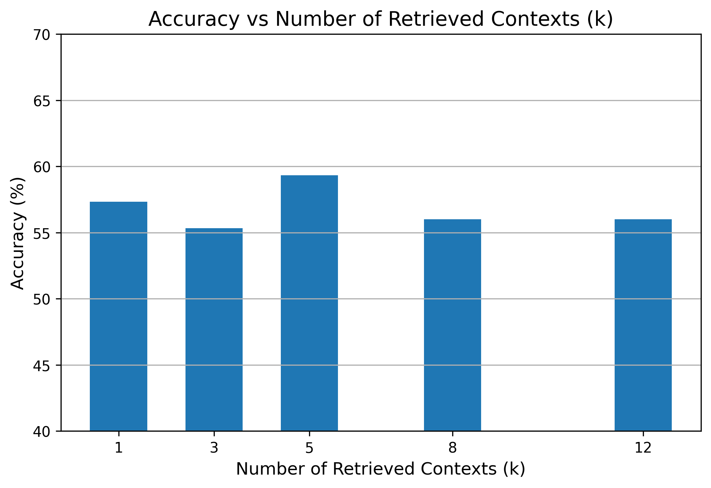

# TECHNICAL DETAILS


# Data-Collection-Preprocessing

## File Description

The Notebook, `1a_Preprocessing.ipynb`, is responsible for the data acquisition, cleaning, transformation, and preparation of diverse medical question-answering datasets. It integrates data from various public sources like Hugging Face and Kaggle, standardizes their format, and structures them for training and evaluating our medical Q&A system. The notebook concludes with splitting the data into training and testing sets and saving them for subsequent use. The PubMed data for the RAG pipeline was processed in `1b_Preprocessing_RAG.ipynb` separately.

## Key Functionality

The notebook performs the following main tasks:

1.  **Initial Setup and Imports:**
    *   Installs necessary libraries such as `datasets`, `kaggle`, and `pandas`.
    *   Imports modules required for data loading (`datasets`), JSON handling (`json`), web requests (`requests`), time delays (`time`), regular expressions (`re`), data manipulation (`pandas`), and Kaggle API interaction.

2.  **Data Acquisition:**
    *   Loads medical Q&A datasets from the Hugging Face Hub. Retry logic is implemented for robust dataset loading.
    *   Downloads datasets from Kaggle using the Kaggle API (`thedevastator/comprehensive-medical-q-a-dataset`, `pythonafroz/medquad-medical-question-answer-for-ai-research`). Authentication is managed by setting environment variables for the Kaggle username and API key.

3.  **Data Transformation:**
    *   Specific functions for each source to standardize the data format.
    *   We transformed the data into a unified structure containing entries such as:
        *   `question`: The text of the question.
        *   `answer`: The answer for short answer and true/false questions.
        *   `correct_answer`: The correct option for multiple-choice questions (e.g., "A", "B").
        *   `options`: A dictionary of options for multiple-choice questions (e.g., `{"A": "Option A text", ...}`).
        *   `reasoning`: A list of steps for multi-hop questions.
        *   `source`: An identifier for the original dataset source.
        *   `type`: The category of the question (e.g., `"multiple_choice"`, `"true_false"`, `"short_answer"`, `"multi_hop"`).
    *   Including logic for parsing various data formats, extracting context, and formatting reasoning steps.

4.  **Dataset Consolidation:**
    *   Combines the transformed data from all sources into a single Python dictionary (`full_dataset`), where keys represent the question types and values are lists of corresponding data entries.
    *   Randomly shuffles the data within each category.

5.  **Data Cleaning:**
    *   Removes multiple-choice entries where the `correct_answer` is `None`.

6.  **Dataset Splitting:**
    *   Divides the `full_dataset` into `train_dataset` and `test_dataset` dictionaries, maintaining the same structure.
    *   Splits each question type category individually into an 80% training set and a 20% testing set.

7.  **Saving Processed Data:**
    *   Saves the `full_dataset`, `train_dataset`, and `test_dataset` dictionaries as JSON files (`full_dataset.json`, `train_dataset.json`, `test_dataset.json`) in a specified directory (`FINAL_DATASETS`).

8.  **Outdated Code Section:**
    *   Includes a section marked as "Outdated" containing code for alternative data splitting/saving methods and processing reasoning datasets that were not ultimately used in the final approach for multi-hop questions as well as some Data Visualization and Analysis that we did during our process of understanding the data better.


# Rag-Specific-Preprocessing
- **Goal**: 
  - preparing training data & pubmed data for pinecone upsert to serve as additional knowledge 
  - ensuring the integrity, traceability, and reproducibility of data throughout the retrieval and generation pipeline 
  
- **How is this achieved?**
  - Assign type-specific unique IDs (e.g., mc_0, tf_1, sa_12, pubmed_345) to each training sample. 
  - Embed source metadata to later verify domain balance and origin. Allows to link back the retrieved context id to the full-text context stored in Google Drive.
```json
{
  "id": "mc_0",
  "question": "Root completion of permanent tooth occurs",
  "correct_answer": "B",
  "options": {
    "A": "1-1 1/2 year after eruption",
    "B": "2-3 year after eruption",
    "C": "6 months after eruption",
    "D": "None of the above"
  },
  "source": "MC3-openlifescienceai/medmcqa",
  "type": "multiple_choice"
}

```
-
    - **Special Handling of Multiple Choice Answers**: answers must be fully self-contained and contextually consistent in our vector store.
      - `"correct_answer": "B"`  must be converted into meaningful text  → "2-3 years after eruption" that can be embedded for semantic retrieval.
      

      - correct answers like **"All of the above."** / **"None of the above."** need to display the list of correct strings in the answer field 
      
   


- **Implementation Details: → see utils/RAG_preprocessing.py** used in notebook 1b
  - DataPaths: Manages the structured access to dataset files across all stages, including raw, processed, and experimental variants. 
  - AddingIDs: Assigns consistent, type-prefixed unique IDs to each question (e.g., mc_23, mh_14). PubMed abstracts also get pubmed_ IDs. 
  - CheckingSources: Aggregates and optionally visualizes source metadata per question type to monitor dataset diversity. 
  - DataStats: Provides summary statistics and key integrity checks (missing fields, ID presence, etc.).


# topic-modeling-index1
(INDEX 1)
- **Goal**: 
  - Finding a representative PubMed subset to insert into our pinecone RAG Vector store
  - Stay within embedding & memory limits for Pinecone
  
- **How is this achieved?** 
  - By reduced the original 2.5 million PubMed abstracts to a diverse, representative 11k sample of biomedical content using topic modeling techniques.

- **Implementation Details**
  - Sample Selection: Randomly selected 250,000 abstracts from the full corpus for scalable preprocessing. 
  - Text Cleaning & Preprocessing: Used **spaCy** for lowercasing, stopword removal, lemmatization, and filtering (see 1b_preprocessing_RAG.ipynb)
  - Embedding Model: Generated vector representations using **Bio_ClinicalBERT** for semantic richness tailored to clinical contexts. 
  - Dimensionality Reduction: Applied UMAP to embed documents into a lower-dimensional space. 
  - Clustering: Used HDBSCAN to group similar abstracts, facilitating unsupervised topic discovery. 
  - Topic Extraction: Leveraged **BERTopic** on top of this structure to extract and label topics (27 topics in total).
    Examples: 
    - Topic 13 → ['patient', 'ventricular', 'coronary', 'artery', 'myocardial'] 
    - Topic 5 → ['glucose', 'insulin', 'plasma', 'diabetic', 'control']
  - Sampling per Topic: Selected a proportional number of documents from each topic to construct a balanced ~11,000-document subset. 
    - Intertopic Distance Map: Visual inspection confirms topic separability. 
      
    
    

    
# Pubmed-Balanced-Index2
(INDEX 2)

- **Goal**:
  - mitigate training data dominance in the vector store (in Index 1, we observed that 400K training questions outnumbered 11K PubMed abstracts)
  - this was evident in retrieval bubble plots, where most documents retrieved came from the same domain as the test question.
  
   

- **How is this achieved?**
  - Populating a new index 2 
  - Strategy for Balance: 100K training questions (25K per question type: MC, TF, SA, MH) / 100K PubMed abstracts from the full 2.5M collection
  - benefit: Improved question-type diversity in retrieved contexts

- **Implementation Details** see `2d_PubMed_train_balanced.ipynb`

- **Result** 
  - shows better spread and fairness in document sourcing (increased PubMed representation) but still tends to retrieve documents from the same question type (performance similar to Index 1 across all question types)


  


# Retrieve-k-Experiments

- **Goal**:
  - finding the optimal number of retrieved contexts (k) to feed into DeepSeek

- **How is this achieved?**
  - systematic experiments on multiple choice questions based on literature research
  - Tested: `k = 1, 3, 5, 8, 12`, checking accuracy on 300 samples

- **Implementation Details** see `2b_NaiveRAG_k_experiment.ipynb` 

- **Findings**:
  - k = 5 yielded best performance (~59.3%) 
  - check results in /content/k_experiments for all confusion matrices




# Baseline
We used the /deepseek-coder-7b-instruct-v1.5 model, which is focused on programming and code.
- It was trained on 2T tokens with a window size of 4K.
- Additionally, it was fine-tuned on 2B tokens of instruction data.

This allowed the model to answer the questions in the correct format.

We leveraged the guidelines for DeepSeek models, such as using clear and specific prompts, avoiding system prompts, and avoiding few-shot prompting.
We experimented with different prompts and found that the ones listed in prompt_utils.py and used in this file worked best to achieve the desired output formats.

For the pipeline parameters, we used the setup below for the different question types. Since both True/False and MC questions only need to produce very short answers, we set the `max_new_tokens` to a lower number than in the SA and MH questions. Similarly, we set the `temperature` to 0.1 for True/False and MC because we did not want any creativity in the answer, but rather the most probable prediction. For SA and MH, we set the temperature to 0.7, as this was recommended in the literature.


# Fine-tuning
We fine-tuned the /deepseek-coder-7b-instruct-v1.5 model using a fully supervised approach, where the model learns to generate the correct answer directly from the provided prompt.

To achieve this, we concatenated the question prompt with the correct answer option into a single string (`prompt_n_answer`) and trained the model on this combined sequence. Every token in the input was used as a label, enabling the model to learn from the entire prompt–answer structure without any masking. The rationale behind this approach was to expose the model to more medical context, helping it better understand and internalize domain-specific patterns through full-sequence supervision.

We set the fine-tuning up for 3 epochs, but stopped the process after 8 hours due to compute unit constraints in colab. We employed a small batch size (1 per device) to avoid RAM overflow but a gradient accumulation steps of 8, effectively simulating a larger batch size. We used a learning rate of 2e-4 and enabled mixed-precision (fp16) training to reduce memory usage (similar as above, to avoid RAM overflow) and speed up training.

We monitored training and evaluation loss using Weights & Biases.

The concrete LoRA configuration is shown below.


# Evaluation
- **Goal**:
  - To systematically evaluate the performance of the full Adv RAG + Finetuned DeepSeek pipeline across all question types 
  - Compare different Pinecone index configurations (imbalanced **Index 1** vs. balanced **Index 2**) to measure accuracy and answer quality.

- **How is this achieved?**
  - Inference Pipeline: Retrieves top-k relevant contexts using Pinecone and passes them to the finetuned DeepSeek model.
  - Answer Extraction: Applies tailored logic per question type (MC, TF, SA, MH) to extract answers from the model's output.
  - Version 1: Uses rag-trainset-index (400K training + 11K PubMed abstracts, imbalanced)
  → All True-False questions included, may skew retrieval due to overrepresentation of training data.
  - Version 2: Uses balanced-index (100K training + 100K PubMed, balanced)
  → Better question-type balance, with True-False subset filtered to only include “True” answers.
  - Evaluation Metrics:
    - Multiple Choice / True-False: accuracy comparison to ground truth.
    - Short Answer / Matching: qualitative evaluation using metrics like ROUGE and BERTScore.

- **Implementation Details** see `/utils/RAG_adv_pipeline.py`, `/utils/RAG_answer.py`, `/utils/RAG_pinecone.py` used in `4_Evaluation_RAG+FT.ipynb`

- **Results** see `metrics/final_results/...` for scores, confusion matrices and sources for all 5 architectures and question types
  - `AdvRAG+FT/` (Adv RAG index 1)
  - `BalancedAdvRAG+FT/` (Adv RAG index 2)    
  - `Baseline/` (baseline deepseek)
  - `FineTuning/` (fine tuned deepseek)
  - `NaiveRAG/` (Naive RAG with baseline deepseek)
