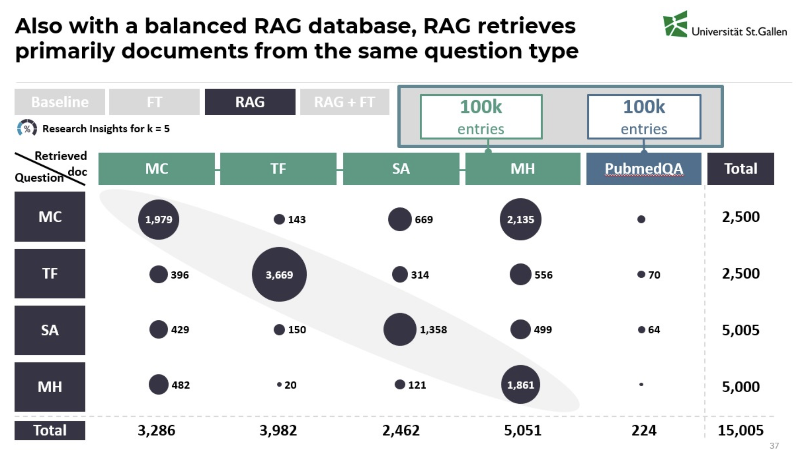

# TECHNICAL DETAILS


# Data-Collection-Preprocessing
## Technical Documentation: 1_Preprocessing.ipynb

## File Description

This Jupyter Notebook, `1_Preprocessing.ipynb`, is responsible for the data acquisition, cleaning, transformation, and preparation of datasets for training a medical Question and Answer (Q&A) system. It integrates data from various sources, structures it into a unified format, and splits it into training and testing sets for subsequent model development.

## Key Functionality

The notebook performs the following main tasks:

1.  **Import Libraries:** Imports necessary libraries for data handling, API interaction, regular expressions, machine learning utilities, and visualization.
2.  **Data Acquisition:**
    *   Loads datasets from the Hugging Face Hub using the `datasets` library.
    *   Downloads datasets from Kaggle using the Kaggle API. Authentication is handled through environment variables for username and API key.
3.  **Data Transformation:**
    *   Defines functions to transform data from each source into a standardized JSON-like structure. This involves extracting questions, answers, options, and source information, and assigning a question `type` (e.g., `multiple_choice`, `true_false`, `short_answer`, `multi_hop`).
    *   Handles variations in source data structures and formats, including parsing options and extracting reasoning steps.
4.  **Dataset Consolidation:** Combines the transformed data from all sources into a single dictionary, categorized by question type.
5.  **Data Cleaning:** Removes entries with missing critical information (e.g., `correct_answer` for multiple-choice questions).
6.  **Dataset Splitting:** Divides the consolidated dataset into training and testing sets using `sklearn.model_selection.train_test_split`. A stratified split is employed based on the question `type` to ensure each question type is represented proportionally in both sets.
7.  **Formatting for Model Training:** Transforms the split datasets into a format suitable for language model training, creating "input" and "output" pairs tailored to each question type.
8.  **Saving Processed Data:** Saves the formatted training and testing datasets as zipped JSON files (`train_dataset.zip` and `test_dataset.zip`). Each zip file contains separate JSON files for each question type (`short_answer_data.json`, `true_false_data.json`, etc.).
9.  **Uploading to GitHub:** Uses the `github3.py` library to upload the generated zip files to a specified GitHub repository. GitHub authentication is handled using a token stored in Colab Secrets.
10. **Data Visualization:** Includes code to generate bar plots showing the distribution of question types and statistics on the multi-hop reasoning data (number of steps and character length) in the training and testing sets.
11. **Model Loading (Partial):** Loads a pre-trained language model (`unsloth/DeepSeek-R1-Distill-Llama-8B`) and its tokenizer using the `transformers` library, in preparation for potential fine-tuning (although the fine-tuning process itself is only partially defined in the provided code snippet).

## Dependencies

The notebook relies on the following key Python libraries:

*   `IPython`
*   `datasets`
*   `json`
*   `requests`
*   `re`
*   `pandas`
*   `kaggle`
*   `os`
*   `google.colab`
*   `sklearn`
*   `random`
*   `torch`
*   `transformers`
*   `github3`
*   `joblib`
*   `tqdm`
*   `nltk`
*   `seaborn`
*   `matplotlib`
*   `numpy`
*   `zipfile`

## Usage

To execute this notebook, you need:

*   A Google Colab environment.
*   A Kaggle account and API credentials configured in the Colab environment variables (`KAGGLE_USERNAME` and `KAGGLE_KEY`).
*   A GitHub token stored in Colab Secrets with the key `git` for uploading the processed datasets to a GitHub repository.

Running the cells sequentially will perform the data preprocessing steps, generate the training and testing datasets, and upload them to the specified GitHub repository.


# Rag-Specific-Preprocessing
- **Goal**: 
  - preparing training data & pubmed data for pinecone upsert to serve as additional knowledge 
  - ensuring the integrity, traceability, and reproducibility of data throughout the retrieval and generation pipeline 
  
- **How is this achieved?**
  - Assign type-specific unique IDs (e.g., mc_0, tf_1, sa_12, pubmed_345) to each training sample. 
  - Embed source metadata to later verify domain balance and origin. Allows to link back the retrieved context id to the full-text context stored in Google Drive.
```json
{
  "id": "mc_0",
  "question": "Root completion of permanent tooth occurs",
  "correct_answer": "B",
  "options": {
    "A": "1-1 1/2 year after eruption",
    "B": "2-3 year after eruption",
    "C": "6 months after eruption",
    "D": "None of the above"
  },
  "source": "MC3-openlifescienceai/medmcqa",
  "type": "multiple_choice"
}

```
-
    - **Special Handling of Multiple Choice Answers**: answers must be fully self-contained and contextually consistent in our vector store.
      - `"correct_answer": "B"`  must be converted into meaningful text  → "2-3 years after eruption" that can be embedded for semantic retrieval.
      

      - correct answers like **"All of the above."** / **"None of the above."** need to display the list of correct strings in the answer field 
      
   


- **Implementation Details: → see utils/RAG_preprocessing.py** used in notebook 1b
  - DataPaths: Manages the structured access to dataset files across all stages, including raw, processed, and experimental variants. 
  - AddingIDs: Assigns consistent, type-prefixed unique IDs to each question (e.g., mc_23, mh_14). PubMed abstracts also get pubmed_ IDs. 
  - CheckingSources: Aggregates and optionally visualizes source metadata per question type to monitor dataset diversity. 
  - DataStats: Provides summary statistics and key integrity checks (missing fields, ID presence, etc.).

    


# Topic-Modeling
(INDEX 1)
- **Goal**: 
  - Finding a representative PubMed subset to insert into our pinecone RAG Vector store
  - Stay within embedding & memory limits for Pinecone
  
- **How is this achieved?** 
  - By reduced the original 2.5 million PubMed abstracts to a diverse, representative 11k sample of biomedical content using topic modeling techniques.

- **Implementation Details**
  - Sample Selection: Randomly selected 250,000 abstracts from the full corpus for scalable preprocessing. 
  - Text Cleaning & Preprocessing: Used **spaCy** for lowercasing, stopword removal, lemmatization, and filtering (see 1b_preprocessing_RAG.ipynb)
  - Embedding Model: Generated vector representations using **Bio_ClinicalBERT** for semantic richness tailored to clinical contexts. 
  - Dimensionality Reduction: Applied UMAP to embed documents into a lower-dimensional space. 
  - Clustering: Used HDBSCAN to group similar abstracts, facilitating unsupervised topic discovery. 
  - Topic Extraction: Leveraged **BERTopic** on top of this structure to extract and label topics (27 topics in total).
    Examples: 
    - Topic 13 → ['patient', 'ventricular', 'coronary', 'artery', 'myocardial'] 
    - Topic 5 → ['glucose', 'insulin', 'plasma', 'diabetic', 'control']
  - Sampling per Topic: Selected a proportional number of documents from each topic to construct a balanced ~11,000-document subset. 
    - Intertopic Distance Map: Visual inspection confirms topic separability. 
      
    
    

    
# Pubmed-Balanced-Index2
(INDEX 2)

- **Goal**:
  - mitigate training data dominance in the vector store (in Index 1, we observed that 400K training questions outnumbered 11K PubMed abstracts)
  - this was evident in retrieval bubble plots, where most documents retrieved came from the same domain as the test question.
  
   

- **How is this achieved?**
  - Populating a new index 2 
  - Strategy for Balance: 100K training questions (25K per question type: MC, TF, SA, MH) / 100K PubMed abstracts from the full 2.5M collection
  - benefit: Improved question-type diversity in retrieved contexts

- **Implementation Details** see `2d_PubMed_train_balanced.ipynb`

- **Result** 
  - shows better spread and fairness in document sourcing (increased PubMed representation) but still tends to retrieve documents from the same question type (performance similar to Index 1 across all question types)



  


# Retrieve-k-Experiments

- **Goal**:
  - finding the optimal number of retrieved contexts (k) to feed into DeepSeek

- **How is this achieved?**
  - systematic experiments on multiple choice questions based on literature research
  - Tested: ` k = 1, 3, 5, 8, 12`, checking accuracy on 300 samples

- **Implementation Details** see `2b_NaiveRAG_k_experiment.ipynb` 

- **Findings**:
  - k = 5 yielded best performance (~59.3%) 
  - check results in /content/k_experiments for all confusion matrices


# Baseline

# Fine-tuning

# Evaluation
 --> check results folder in structure 
